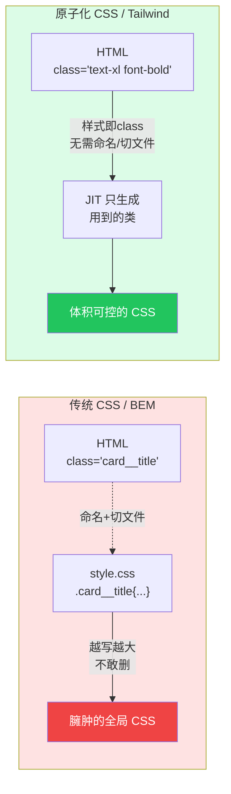

# 01 · 为什么用原子化 CSS（Why Utility-First）

> 原子化（Utility-First）CSS 主张：不再为每个组件手写语义化 class + 独立 CSS 规则，而是用一堆「单一职责的小工具类」直接在 HTML 里拼样式。本模块讲清它到底解决了传统 CSS 的什么痛点。

## 📖 知识讲解

**传统 CSS 的三大痛点（写得越久越明显）：**

1. **命名难。** 「这个 div 叫什么好？」是每天的精神内耗。BEM（`block__element--modifier`）能规范命名，但依然要为每个元素起名。
2. **CSS 只增不减。** 项目越大 CSS 文件越臃肿，没人敢删——你不知道某条规则还有没有人用。全局作用域让「改 A 崩 B」成为常态。
3. **两个文件来回跳。** 改一个按钮，要在 HTML 找到元素、再去 CSS 找到规则，反复横跳。

**Tailwind 的答案——工具类（utility class）：**

每个类只做一件事，名字即样式，语义固定不变：

| 工具类 | 等价 CSS |
| --- | --- |
| `p-6` | `padding: 1.5rem` |
| `text-xl` | `font-size: 1.25rem` |
| `rounded-xl` | `border-radius: 0.75rem` |
| `bg-violet-600` | `background: #7c3aed` |
| `flex` | `display: flex` |

于是三大痛点被同时消解：

- **不用命名**——不需要 `.card__title` 这种名字，直接 `text-xl font-bold`。
- **CSS 不再膨胀**——所有样式来自一套固定工具类，加功能不新增 CSS 行数；配合 JIT 按需生成，最终产物只含「你真正用到的类」。
- **不用切文件**——样式就在 HTML 元素上，所见即所得。

**常见反驳与回应：**

- 「class 一长串，HTML 很脏」→ 这是把复杂度从「隐藏的 CSS 文件」搬到了「看得见的 HTML」。可读性问题用**组件抽象**（React/Vue 组件、或 `@apply`，见模块 08）解决，而不是回到全局 CSS。
- 「和 inline style 有啥区别」→ 工具类能用**响应式断点**（`md:`）、**状态变体**（`hover:`）、**主题令牌**（颜色/间距来自设计系统），这些 inline `style=""` 都做不到。

**它不是银弹：** 强交互动画、极度定制的一次性样式，写原生 CSS 更直接。Tailwind 也支持[任意值](../07-customization/README.md) `w-[437px]` 兜底。

## 🔄 流程图 / 原理图

## 💻 代码说明

`index.html` 把**同一张卡片**并排写了两遍：

- **左侧（传统 BEM）**：HTML 里写 `class="card__title"`，样式定义在 `<style>` 里的 `.card__title { font-size: 1.25rem; font-weight: 700; ... }`——要理解这个元素长什么样，得跳到 CSS 去看。
- **右侧（Tailwind）**：`class="text-xl font-bold text-slate-800 mb-2"`——样式一眼可见，`text-xl`=字号、`font-bold`=加粗、`mb-2`=下边距，无需任何自定义 CSS，也没起任何名字。

页面用 `` 引入 v4 的浏览器版，双击 HTML 即可看效果。

## ▶️ 运行方式

免构建：**直接用浏览器打开 `index.html`** 即可（Play CDN 会在浏览器里现场编译）。

## ⚠️ 常见坑 / 最佳实践

- **别把 Play CDN 用到生产**。CDN 版在浏览器里实时编译，体积大、首屏慢，仅适合学习/原型。生产用 Vite 构建（模块 02）。
- **HTML「变脏」是错觉**：复杂度并没有凭空增加，只是从看不见的 CSS 挪到了看得见的 HTML；用组件（模块 08）收敛重复。
- **v4 的 CDN 是 `@tailwindcss/browser`**，v3 是 `cdn.tailwindcss.com`，别用混了。

## 🔗 官方文档

- 核心理念：https://tailwindcss.com/docs/styling-with-utility-classes
- 「Utility-First 基础」：https://tailwindcss.com/docs
