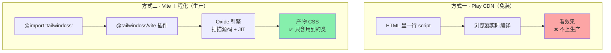

# 02 · 两种安装方式 & v4 vs v3 配置差异（Setup）

> Tailwind 有「免装的 Play CDN」和「工程化的 Vite 构建」两条路。本模块把两条路都跑通，并讲清 v4 的 CSS-first 配置和 v3 到底差在哪。

## 📖 知识讲解

### 方式一：Play CDN（免装，学习/原型用）

一行 `<script>` 塞进 `<head>`，浏览器现场编译，双击 HTML 就能用：

```html
<!-- v4 -->
<script src="https://unpkg.com/@tailwindcss/browser@4"></script>
<!-- v3（旧，别混用） -->
<!-- <script src="https://cdn.tailwindcss.com"></script> -->
```

CDN 版也能定制主题——写一个特殊的 `<style type="text/tailwindcss">` 块，里面用 v4 的 `@theme`。**缺点：** 浏览器实时编译，体积大、首屏慢，**严禁上生产**。

### 方式二：Vite 工程化（生产用，推荐）

v4 官方为 Vite 提供了专用插件 `@tailwindcss/vite`，三步搞定：

```bash
npm install                       # 装依赖（本示例已写好 package.json）
npm run dev                       # 启动开发服务器
npm run build                     # 打包生产版（CSS 只含用到的类）
```

三处关键改动：

1. `vite.config.js` 挂 `tailwindcss()` 插件。
2. 入口 CSS 写 `@import "tailwindcss";`。
3. 主题定制写 `@theme { ... }`。

### v4 vs v3 配置差异（本模块重点）

| 维度 | v3（旧） | v4（新，本工程采用） |
| --- | --- | --- |
| **引入 CSS** | `@tailwind base;`<br>`@tailwind components;`<br>`@tailwind utilities;` 三行 | **`@import "tailwindcss";` 一行** |
| **配置文件** | 必需 `tailwind.config.js`（JS 对象） | **不需要**，改用 CSS 里的 `@theme` |
| **主题定制** | JS：`theme: { colors: {...} }` | **CSS-first**：`@theme { --color-brand: #6750a4 }` |
| **PostCSS** | 必须配 `postcss.config.js` + `autoprefixer` | Vite 插件内置，**无需手配** |
| **构建引擎** | JS 实现 | **Oxide 引擎（Rust + Lightning CSS）**，快数倍 |
| **浏览器 CDN** | `cdn.tailwindcss.com` | `@tailwindcss/browser@4` |
| **内容扫描** | `content: [...]` 手动配 glob | **自动检测**源文件，一般免配 |

一句话：**v4 把「JS 配置」搬进了「CSS」，把「PostCSS 那套」收进了官方插件，配置量大幅减少。**

> 想继续用 `tailwind.config.js`？v4 兼容——在 CSS 里写 `@config "./tailwind.config.js";` 即可，方便老项目迁移。

## 🔄 流程图 / 原理图



## 💻 代码说明

- **`index.html`**（本目录）：方式一 Play CDN 演示，含 `<style type="text/tailwindcss">` 里的 `@theme` 定制品牌色 `bg-brand`。
- **`vite-project/`**：方式二完整最小工程。
  - `vite.config.js`：`plugins: [tailwindcss()]`。
  - `src/style.css`：`@import "tailwindcss";` + `@theme`。
  - `index.html`：`<link rel="stylesheet" href="/src/style.css">`。

## ▶️ 运行方式

**方式一（免装）**：双击本目录 `index.html`。

**方式二（工程化）**：

```bash
cd vite-project
npm install
npm run dev      # 打开终端提示的 http://localhost:5173
npm run build    # 生产打包，产物在 dist/
```

## ⚠️ 常见坑 / 最佳实践

- **v3 的三行 `@tailwind` 指令在 v4 会失效**，v4 只认 `@import "tailwindcss";`。
- Play CDN 的 `cdn.tailwindcss.com` 是 **v3**；v4 用 `@tailwindcss/browser@4`。
- v4 用 Vite 插件后**不要再手写 `postcss.config.js`**，否则可能重复处理。
- 若非 Vite 项目（如纯 PostCSS/CLI），v4 对应包是 `@tailwindcss/postcss` 或 `@tailwindcss/cli`。

## 🔗 官方文档

- Vite 安装：https://tailwindcss.com/docs/installation/using-vite
- 从 v3 升级：https://tailwindcss.com/docs/upgrade-guide
