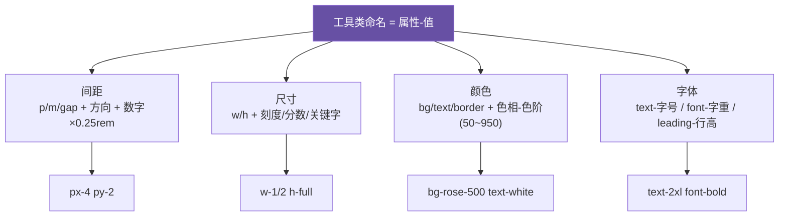

# 03 · 核心工具类：间距 / 尺寸 / 颜色 / 字体（Core Utilities）

> 90% 的日常样式都由这四类工具类拼出来。记住它们的命名规律，就能「看名字猜样式、想样式猜名字」。

## 📖 知识讲解

Tailwind 工具类的命名有强规律，核心是 **`属性-值`** 的缩写。

### ① 间距 Spacing（padding / margin / gap）

- `p`=padding，`m`=margin，`gap`=flex/grid 间隙。
- 方向后缀：`t`上 `r`右 `b`下 `l`左 `x`水平 `y`垂直。例：`px-4`=左右 padding，`mt-2`=上 margin。
- **数值 = 数字 × 0.25rem（4px）**：`p-4` → 1rem，`p-1` → 0.25rem。负 margin 用 `-mt-2`。
- 特殊：`space-x-2` / `space-y-4` 给「子元素之间」加间距。

### ② 尺寸 Sizing（width / height）

- `w-*` 宽、`h-*` 高。取值有三种：
  - **间距刻度**：`w-32` = 8rem（同样 ×0.25rem）。
  - **分数**：`w-1/2`=50%、`w-1/3`=33.3%。
  - **关键字**：`w-full`=100%、`w-screen`=100vw、`w-auto`、`min-w-0`、`max-w-md`。

### ③ 颜色 Color（背景 / 文字 / 边框）

- `bg-*` 背景、`text-*` 文字、`border-*` 边框、`ring-*` 外发光环、`fill-*` SVG 填充。
- **色板**：色相（slate/gray/red/rose/sky/emerald/violet…）+ **11 级色阶**（`50 100 200 … 900 950`），数字越大越深。例 `bg-rose-500`、`text-slate-600`。
- **透明度**用斜杠：`bg-black/50`（50% 不透明度）。
- v4 默认色板改用 **oklch 色彩空间**，色彩更鲜艳一致。

### ④ 字体 Typography

- 字号：`text-xs / sm / base / lg / xl / 2xl … 9xl`（`base`=16px）。
- 字重：`font-thin/light/normal/medium/semibold/bold/black`。
- 行高：`leading-none/tight/normal/relaxed/loose`。
- 字间距：`tracking-tight/normal/wide`。
- 对齐/样式：`text-center/right`、`italic`、`underline`、`uppercase`、`truncate`（超出省略号）。
- 字体族：`font-sans/serif/mono`。

## 🔄 流程图 / 原理图

## 💻 代码说明

`index.html` 分四块演示：

- **间距**：`p-2 → p-4 → p-6` 递增，直观看到 padding 变大；`px-8 py-2` 展示水平/垂直分离。
- **尺寸**：`w-24 / w-48 / w-1/2 / w-full` 四条不同宽度的条。
- **颜色**：`bg-rose-100 → 900` 展示色阶；`text-emerald-600 border-emerald-500` 展示文字与边框色。
- **字体**：`text-xs → 2xl` 字号阶梯，`font-bold`、`italic`、`tracking-wide`、`leading-loose` 各种排版。

## ▶️ 运行方式

免构建：**直接浏览器打开 `index.html`**。

## ⚠️ 常见坑 / 最佳实践

- **数字不是像素**：`p-4` 是 1rem 不是 4px，记住「×0.25rem」。
- `text-*` 一词多义：`text-xl` 是字号、`text-red-500` 是颜色、`text-center` 是对齐——靠后缀区分。
- 想要设计系统之外的精确值，用**任意值** `w-[437px]`、`text-[#1da1f2]`（见模块 07），但优先用刻度保持一致性。
- `border-*` 颜色要生效，通常还需 `border`（给出边框宽度）。

## 🔗 官方文档

- Padding：https://tailwindcss.com/docs/padding
- Colors：https://tailwindcss.com/docs/colors
- Font Size：https://tailwindcss.com/docs/font-size
