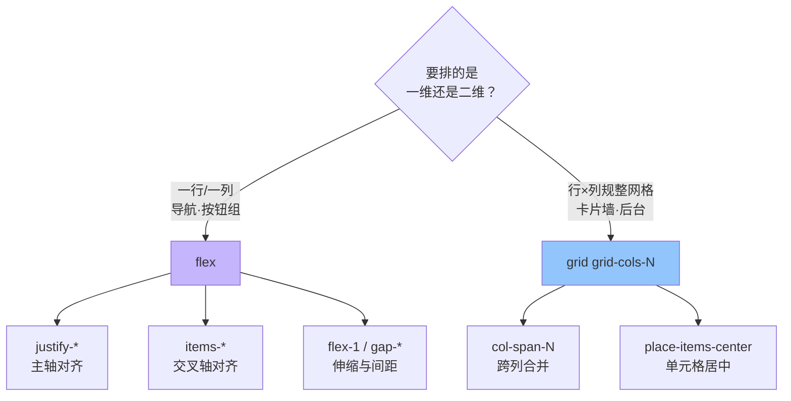

# 04 · Flexbox 与 Grid 布局（Flexbox & Grid）

> 布局是页面骨架。Tailwind 把 Flexbox 和 Grid 的每一条 CSS 属性都做成了工具类，让你不写一行自定义 CSS 就能拼出导航、卡片墙、圣杯布局。

## 📖 知识讲解

工具类只是「一个类 = 一条 CSS」，所以学布局工具类，本质就是复习 Flex/Grid 属性，再套上命名规律。

### ① Flexbox（一维布局：一行或一列）

| 工具类 | 等价 CSS | 作用 |
| --- | --- | --- |
| `flex` | `display:flex` | 开启弹性盒 |
| `flex-row` / `flex-col` | `flex-direction` | 主轴横向 / 纵向 |
| `flex-wrap` | `flex-wrap:wrap` | 放不下时换行 |
| `justify-start/center/between/around/evenly` | `justify-content` | **主轴**对齐 |
| `items-start/center/stretch/baseline` | `align-items` | **交叉轴**对齐 |
| `gap-4` / `gap-x-2` / `gap-y-4` | `gap` | 子项间距（替代 margin） |
| `flex-1` / `flex-auto` / `flex-none` | `flex` 简写 | 伸缩比例 |
| `grow` / `shrink-0` | `flex-grow/shrink` | 单独控制放大/缩小 |

记忆钥匙：**`justify-` 管主轴，`items-` 管交叉轴**。默认主轴是水平（`flex-row`），此时 `justify-center` 是水平居中、`items-center` 是垂直居中。

### ② Grid（二维布局：行 × 列）

| 工具类 | 等价 CSS | 作用 |
| --- | --- | --- |
| `grid` | `display:grid` | 开启网格 |
| `grid-cols-3` | `grid-template-columns:repeat(3,1fr)` | 3 等分列 |
| `grid-rows-2` | `grid-template-rows` | 2 行 |
| `col-span-2` | `grid-column:span 2` | 跨 2 列 |
| `row-span-2` | `grid-row:span 2` | 跨 2 行 |
| `gap-4` | `gap` | 行列间距 |
| `place-items-center` | `place-items` | 单元格内容居中 |
| `grid-cols-[auto_1fr_auto]` | 任意模板 | 自定义列宽（任意值语法） |

**Flex vs Grid 怎么选**：一行/一列排列（导航、按钮组）用 Flex；需要横竖都对齐的规整二维（卡片墙、后台布局）用 Grid。

### ③ 居中的三种常用写法

- Flex：`flex items-center justify-center`
- Grid：`grid place-items-center`（最短）
- 绝对定位：`absolute inset-0 m-auto`

## 🔄 流程图 / 原理图

## 💻 代码说明

`index.html` 五块演示：

1. **Flex 导航栏**：`flex items-center justify-between` 让 LOGO / 菜单 / 按钮三段两端对齐并垂直居中；菜单内部用 `flex gap-6`。
2. **弹性伸缩**：两侧 `w-24` 固定，中间 `flex-1` 吃掉剩余宽度——响应式容器最常见的模式。
3. **方向与换行**：`flex-wrap` 让标签在窗口变窄时自动折行，不溢出。
4. **Grid 卡片墙**：`grid grid-cols-3 gap-4`，其中一张用 `col-span-2` 横跨两列。
5. **页面骨架**：`grid-cols-4` + `grid-rows-[auto_1fr_auto]`（任意值模板）+ `col-span-*` 一次画出 头/侧栏/主体/脚。

## ▶️ 运行方式

免构建：**直接用浏览器打开 `index.html`**。缩放窗口观察 `flex-wrap` 换行效果。

## ⚠️ 常见坑 / 最佳实践

- **`justify-` 和 `items-` 别记反**：主轴用 justify，交叉轴用 items。换了 `flex-col` 后两者的方向也跟着交换。
- **优先用 `gap-*` 而不是给子项加 margin**：gap 不会在首尾多出边距，也不用清「最后一个的 margin」。
- `grid-cols-3` 默认是 `1fr 1fr 1fr` 等分；要不等分用任意值 `grid-cols-[200px_1fr]`。
- Grid 里 `place-items-center` = `items-center` + `justify-items-center` 的合写，居中最省字。

## 🔗 官方文档

- Flexbox：https://tailwindcss.com/docs/flex
- Grid Template Columns：https://tailwindcss.com/docs/grid-template-columns
- Gap：https://tailwindcss.com/docs/gap
- Justify / Align：https://tailwindcss.com/docs/justify-content
