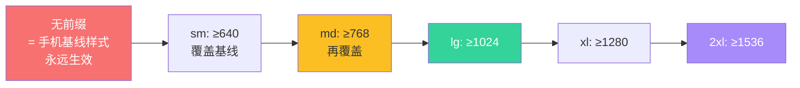
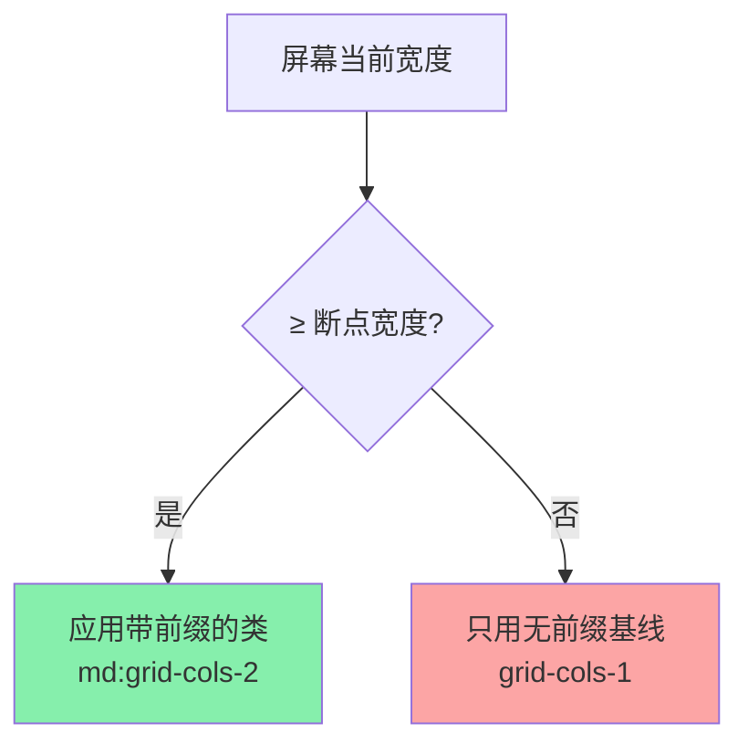

# 05 · 响应式设计：断点前缀（Responsive Design）

> 一套 HTML 适配手机 / 平板 / 桌面。Tailwind 用 `md:` `lg:` 这样的**断点前缀**给工具类加上「屏幕多宽才生效」的条件，且默认是 **Mobile-First（移动优先）**。

## 📖 知识讲解

### ① 五个默认断点（min-width，从小到大）

| 前缀 | 最小宽度 | 典型设备 |
| --- | --- | --- |
| （无） | 0 | 手机（默认样式，永远生效） |
| `sm:` | 640px | 大手机 / 竖屏平板 |
| `md:` | 768px | 平板 |
| `lg:` | 1024px | 笔记本 |
| `xl:` | 1280px | 桌面 |
| `2xl:` | 1536px | 大屏 |

### ② Mobile-First 是关键心智模型

**断点前缀是「≥ 该宽度才生效」，不是「= 该宽度」。** 所以：

```html
<!-- 手机 1 列；≥768px 变 2 列；≥1024px 变 4 列 -->
<div class="grid grid-cols-1 md:grid-cols-2 lg:grid-cols-4">
```

- **无前缀的类写「最小屏（手机）」的样式**，是基线。
- **前缀类只在更大屏覆盖**基线。样式从小屏向大屏「层层叠加」。
- 所以要「手机隐藏、桌面显示」是 `hidden lg:block`；反过来「手机显示、桌面隐藏」是 `block lg:hidden`。别写成 `lg:block` 却指望它在手机隐藏——不写基线就默认显示。

### ③ 区间与自定义断点

- 只想「≥md 且 <lg」用 `md:max-lg:`（v3.2+ / v4 的 `max-*` 变体）。
- 自定义断点：v3 在 `tailwind.config.js` 的 `theme.screens`；**v4 直接在 CSS `@theme` 里写 `--breakpoint-xl: 1600px`**。
- 任意断点一次性用：`min-[900px]:flex`、`max-[500px]:hidden`。

### ④ v4 新增：容器查询（Container Queries）

v3 需要装插件，**v4 内置**。用 `@container` 标记容器，子元素用 `@md:` 按**父容器宽度**（而非视口）响应，适合可复用组件：

```html
<div class="@container">
  <div class="grid @md:grid-cols-2">…</div>
</div>
```

> 另一个 v4 变化：`container` 这个工具类在 v4 里更简单——它默认 `width:100%` 且可用 `@theme` 定制，不再依赖 `container.center`/`padding` 的 JS 配置。

## 🔄 流程图 / 原理图





## 💻 代码说明

`index.html` 四块，全部靠拖动窗口宽度观察：

1. **当前断点指示器**：每个色块用 `hidden xx:block yy:hidden` 组合，使得任意宽度下只有一个可见——直观感受断点边界。
2. **响应式卡片墙**：`grid-cols-1 md:grid-cols-2 lg:grid-cols-4`，列数随宽度递增。
3. **布局方向切换**：`flex-col md:flex-row`，窄屏纵向堆叠、宽屏左右并排。
4. **响应式字号与显隐**：`text-lg md:text-2xl lg:text-4xl` 让标题随屏变大；`hidden lg:inline` / `lg:hidden` 控制文字按屏显隐。

## ▶️ 运行方式

免构建：**浏览器打开 `index.html`**，然后**拖动窗口边缘改变宽度**（或用 DevTools 设备模式）观察断点跳变。

## ⚠️ 常见坑 / 最佳实践

- **最常见错误**：想在手机隐藏却只写 `lg:block`。要写 `hidden lg:block`——基线默认显示，必须先 `hidden` 再在大屏 `block`。
- 断点是 **min-width**（大屏继承小屏），不是区间。要区间用 `max-*`（如 `max-md:hidden`）。
- **别用 max 前缀反向写全站**，那等于放弃了 Mobile-First 的层叠优势；除个别「仅小屏」场景外优先 min-width。
- 组件级适配（卡片放在窄侧栏里）用 **容器查询 `@container` + `@md:`**，比视口断点更贴合复用场景（v4 内置）。

## 🔗 官方文档

- Responsive Design：https://tailwindcss.com/docs/responsive-design
- 容器查询：https://tailwindcss.com/docs/responsive-design#container-queries
- 自定义断点（v4 @theme）：https://tailwindcss.com/docs/theme
