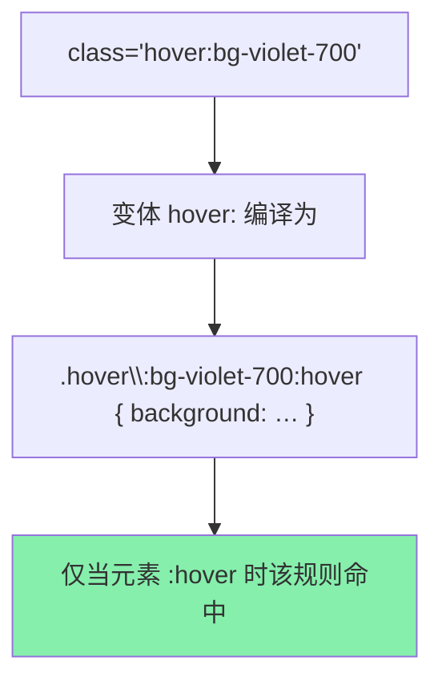
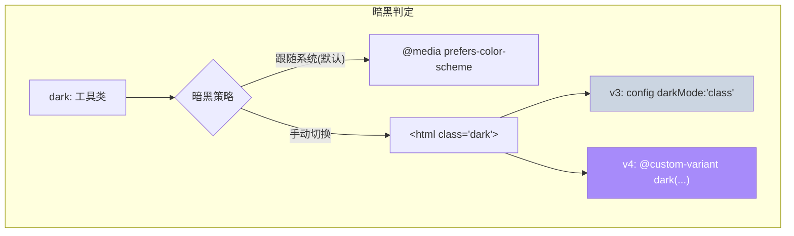

# 06 · 状态变体与暗黑模式（States & Dark Mode）

> `hover:` `focus:` `dark:` 这些**变体前缀（variant）**让工具类「只在某个状态下生效」。不写一行 JS、不写一条媒体查询，就能做出交互反馈和亮/暗双主题。

## 📖 知识讲解

变体（variant）= 前缀 + `:` + 工具类，含义是「**在某条件下才应用这个类**」。断点 `md:` 是变体的一种，本模块讲交互 / 关系 / 主题类变体。

### ① 交互状态变体

| 变体 | 何时生效 |
| --- | --- |
| `hover:` | 鼠标悬停 |
| `focus:` | 元素聚焦（Tab 到 / 点击输入框） |
| `active:` | 按下的一瞬间 |
| `disabled:` | 元素被 `disabled` |
| `focus-within:` | 内部**任意子元素**聚焦（做输入框外框高亮） |
| `focus-visible:` | 仅键盘聚焦才显示焦点环（鼠标点击不显示） |

```html
<button class="bg-violet-600 hover:bg-violet-700 active:bg-violet-800
               focus:ring-4 focus:ring-violet-300 disabled:bg-slate-300">
```

### ② 关系变体：`group` 与 `peer`

- **`group` / `group-hover:`**——父子联动。父元素加 `group`，子元素用 `group-hover:text-violet-600`，则**悬停父级**时子级变化。做卡片整体 hover 效果神器。
- **`peer` / `peer-invalid:`**——兄弟联动。给前一个元素加 `peer`，后面的兄弟用 `peer-checked:` / `peer-invalid:` / `peer-focus:` 响应它的状态。可实现**纯 CSS 表单校验提示、纯 CSS 开关**。
- 都支持具名：`group/item`、`peer/email`，避免多层嵌套串味。

### ③ 暗黑模式 `dark:`（v4 vs v3 重点差异）

`dark:bg-slate-900` 表示「暗色模式下背景变深」。**如何判定「暗色模式」有两种策略**：

| 策略 | 触发条件 | v3 配置 | v4 配置 |
| --- | --- | --- | --- |
| **跟随系统**（默认） | `@media (prefers-color-scheme: dark)` | 默认 | 默认 |
| **手动 class 切换** | `<html class="dark">` | `tailwind.config.js` 写 `darkMode: 'class'` | **在 CSS 写 `@custom-variant dark (&:where(.dark, .dark *));`** |

这是 v4 最典型的「配置从 JS 搬到 CSS」的例子。本 demo 用的就是手动切换，所以 `<style type="text/tailwindcss">` 里写了那行 `@custom-variant`，再用 JS `classList.toggle('dark')`。

### ④ 变体可以叠加

多个前缀从左往右叠：`dark:md:hover:bg-slate-700` = 「暗色 且 ≥md 且 悬停」时生效。顺序不影响结果，但建议按「响应式→状态→主题」习惯排列以便阅读。

## 🔄 流程图 / 原理图





## 💻 代码说明

`index.html` 四块 + 右上角切换按钮：

1. **交互状态**：一个按钮同时挂 `hover: / active: / focus:ring`；另一个 `disabled` 演示 `disabled:` 变体；输入框外框用 `focus-within:border-violet-500`。
2. **group**：整张卡片 `.group`，标题 `group-hover:text-violet-600`、箭头 `group-hover:translate-x-2`——悬停卡片任意处，子元素齐动。
3. **peer**：邮箱 `input` 加 `peer`，错误提示用 `peer-invalid:peer-focus:block`，纯 CSS 校验反馈。
4. **dark:**：整页与卡片都写了 `bg-white dark:bg-slate-800` 两套色；`@custom-variant dark` + JS 切 `.dark` 使按钮可手动切主题。

## ▶️ 运行方式

免构建：**浏览器打开 `index.html`**。悬停/点击/Tab 观察状态；点右上角按钮切换亮暗；邮箱框输错格式看校验提示。

## ⚠️ 常见坑 / 最佳实践

- **v4 手动暗黑不再改 JS config**：要能用 `.dark` 类切换，必须在 CSS 写 `@custom-variant dark (&:where(.dark, .dark *));`，否则 `dark:` 只跟随系统。
- `group-hover:` 要生效，父元素必须真的有 `group` 类；`peer-*` 要求 peer 元素是**同级且在前**。
- 每个需要变色的元素都要**同时写亮色和 `dark:` 暗色**两套，漏写暗色会在暗黑下「白底黑字」露馅。
- 加 `transition` / `transition-colors` 让状态切换有过渡，观感更顺。

## 🔗 官方文档

- 悬停/聚焦等状态：https://tailwindcss.com/docs/hover-focus-and-other-states
- 暗黑模式：https://tailwindcss.com/docs/dark-mode
- 自定义变体 @custom-variant：https://tailwindcss.com/docs/functions-and-directives#custom-variant
