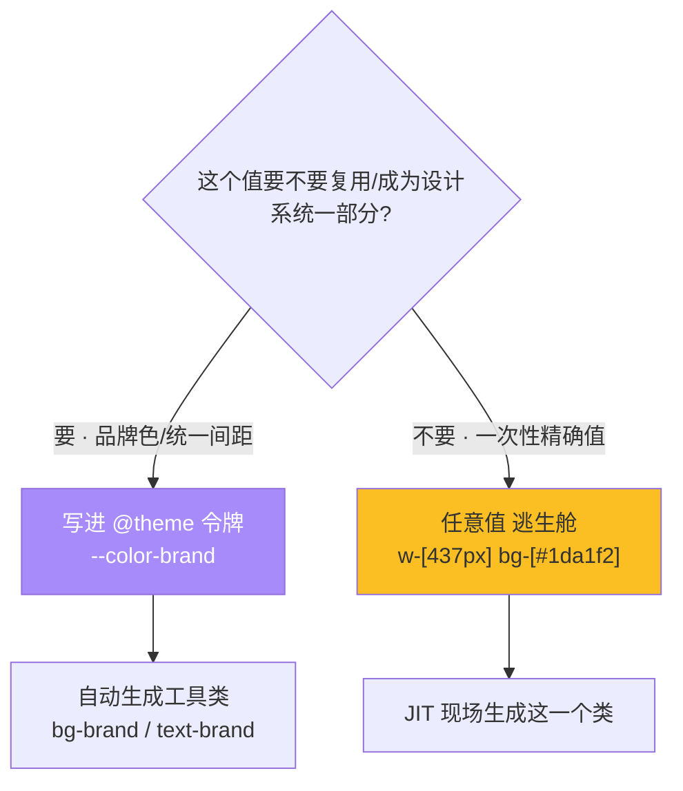
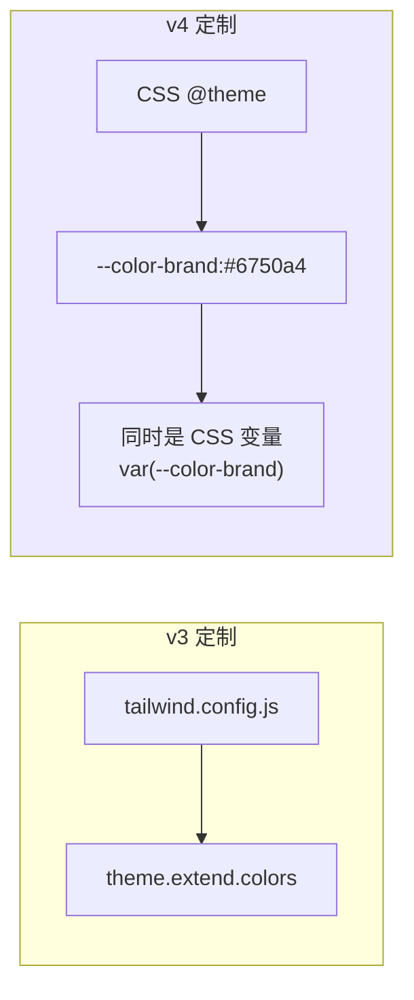

# 07 · 主题定制与任意值（Customization & Arbitrary Values）

> 设计系统要「统一」，也要留「逃生舱」。Tailwind 用 `@theme`（v4）把你的品牌色、间距、字体注册成设计令牌 → 自动生成工具类；用**任意值 `[...]`** 处理系统之外的一次性精确值。

## 📖 知识讲解

### ① 定制主题：v4 的 `@theme`（CSS-first） vs v3 的 config

Tailwind 的所有工具类，值都来自一套**设计令牌（design tokens）**——颜色刻度、间距刻度、字号、圆角……定制就是改这套令牌。

**v3（旧）——JS 配置：**

```js
// tailwind.config.js
module.exports = {
  theme: {
    extend: {
      colors: { brand: '#6750a4' },
      spacing: { huge: '6rem' },
    },
  },
}
```

**v4（新）——CSS 里的 `@theme`：**

```css
@import "tailwindcss";
@theme {
  --color-brand: #6750a4;   /* → 自动生成 bg-brand / text-brand / border-brand … */
  --spacing-huge: 6rem;     /* → p-huge / m-huge / gap-huge … */
  --font-display: "Georgia", serif;  /* → font-display */
  --radius-blob: 2rem 0.5rem;         /* → rounded-blob */
}
```

**命名空间即用途**：令牌名前缀决定它生成哪类工具类——`--color-*`→颜色类，`--spacing-*`→间距/尺寸类，`--font-*`→字体族，`--radius-*`→圆角，`--breakpoint-*`→断点。这是 v4 的核心约定。

好处：① 令牌同时是**真正的 CSS 变量**，可在自定义 CSS 里 `var(--color-brand)` 复用；② 配置和样式在同一处，少一个 JS 文件。想覆盖（而非扩展）内置刻度，用 `--color-*: initial` 先清空。

> 老项目想继续用 `tailwind.config.js`？v4 兼容：CSS 里写 `@config "./tailwind.config.js";`。

### ② 任意值 Arbitrary Values（逃生舱）

设计刻度里没有的值，**不必改配置**，用方括号即写即用：

| 写法 | 含义 |
| --- | --- |
| `w-[437px]` | 精确宽度 437px |
| `bg-[#1da1f2]` | 任意十六进制色 |
| `text-[27px]` | 任意字号 |
| `grid-cols-[repeat(3,80px)]` | 任意网格模板 |
| `top-[calc(50%-4px)]` | 任意 calc（空格用 `_` 或加下划线） |
| `bg-[var(--x)]` | 引用 CSS 变量 |

### ③ 任意属性 Arbitrary Properties

连**没有对应工具类**的 CSS 属性也能写：`[writing-mode:vertical-rl]`、`[mask-type:luminance]`。语法是 `[属性:值]`，同样支持变体前缀（`hover:[writing-mode:...]`）。

## 🔄 流程图 / 原理图





## 💻 代码说明

`index.html` 在 `<style type="text/tailwindcss">` 的 `@theme` 里注册了 `--color-brand`、`--color-brand-light`、`--spacing-huge`、`--font-display`、`--radius-blob`，然后：

1. **令牌工具类**：直接用 `bg-brand` / `text-brand` / `border-brand` / `rounded-blob` / `font-display`，和内置类无差别。
2. **自定义刻度**：`p-huge` 得到 6rem padding。
3. **任意值**：`w-[437px]`、`bg-[#1da1f2]`、`text-[27px] leading-[1.1]`、`grid-cols-[repeat(3,80px)]`。
4. **任意属性**：`[writing-mode:vertical-rl]` 做竖排文字。

> 本 demo 用 Play CDN 演示 `@theme`，工程化里把它写进入口 CSS 即可（见模块 02 的 vite-project）。

## ▶️ 运行方式

免构建：**浏览器打开 `index.html`**。

## ⚠️ 常见坑 / 最佳实践

- **v4 定制优先用 `@theme`，不要再新建 `tailwind.config.js`**（除非迁移老项目，用 `@config` 引入）。
- 令牌**命名空间**必须对：品牌色是 `--color-xxx` 才会生成 `bg-xxx`；写成 `--brand` 不会生成任何类。
- **任意值是逃生舱，不是日常主力**：能进设计系统的值就进 `@theme`，滥用 `[...]` 会让样式重新变得零散、失去一致性。
- 任意值里**空格不能直接写**，用下划线 `_` 代替（如 `grid-cols-[1fr_2fr]`）；真的要空格用 `\_` 转义。

## 🔗 官方文档

- 主题 @theme：https://tailwindcss.com/docs/theme
- 任意值：https://tailwindcss.com/docs/adding-custom-styles#using-arbitrary-values
- 颜色定制：https://tailwindcss.com/docs/colors#customizing-your-colors
