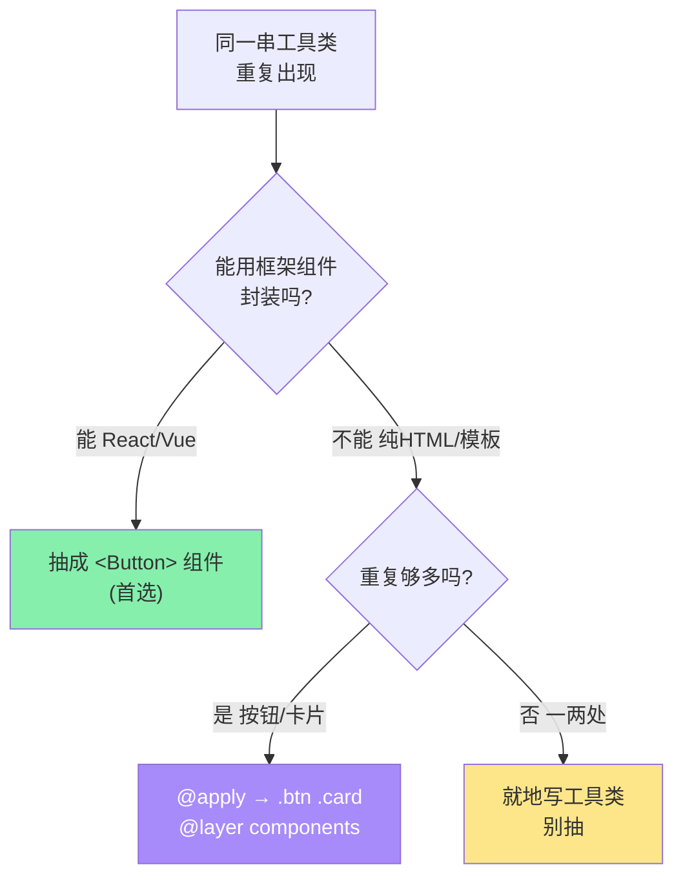
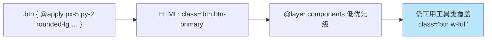

# 08 · @apply 抽取组件类（Extracting Components with @apply）

> 当同一串工具类被复制很多遍、HTML 变冗长时，用 `@apply` 把它们「打包」成一个语义化的组件类（`.btn`、`.card`），一处定义、处处复用。这是原子化 CSS 里「组件抽象」的官方手段。

## 📖 知识讲解

### ① 为什么需要 @apply

模块 01 说过原子化的争议：「HTML 里 class 一长串」。官方给的解法是**组件抽象**——首选是**框架组件**（React/Vue 把 `<Button>` 封起来），但在**纯 HTML、模板片段、或 Markdown 渲染**等无法抽组件的场景，就用 `@apply` 在 CSS 层收敛：

```css
@layer components {
  .btn {
    @apply inline-flex items-center px-5 py-2 rounded-lg font-semibold transition;
  }
  .btn-primary { @apply bg-violet-600 text-white hover:bg-violet-700; }
}
```

HTML 就从 `class="inline-flex items-center px-5 py-2 …十几个类"` 变成 `class="btn btn-primary"`。

### ② `@apply` 的规则

- **只能在 CSS/`@layer` 里用**，把工具类「内联展开」成真实 CSS 声明。
- 可 apply **带变体的类**：`@apply hover:bg-violet-700 md:px-8`。
- 放进 **`@layer components`**：让这些组件类的优先级低于工具类，这样在 HTML 里还能用工具类**覆盖微调**（`class="btn w-full"` 里的 `w-full` 生效）。
- v4 里 `@apply` 依然可用；若在**独立 CSS 文件/组件的 `<style>`** 里 `@apply` 用到主题令牌，需要 `@reference "tailwindcss";` 让该文件能识别工具类。

### ③ v4 vs v3 差异（组件层）

| | v3 | v4 |
| --- | --- | --- |
| `@apply` | 支持 | 支持 |
| 组件层声明 | `@layer components` | `@layer components`（相同） |
| 自定义工具类 | `@layer utilities { .x{…} }` | 推荐用新指令 **`@utility x { … }`**（能参与变体与排序） |
| Vue/Svelte 单文件 `<style>` 里 @apply | 直接可用 | 需 `@reference "tailwindcss";` 或用 `theme()` |

### ④ 什么时候**不要** @apply（官方立场）

Tailwind 官方明确提醒：**不要一上来就把所有东西 `@apply` 成组件类**，那等于绕一圈回到了传统 CSS，丢掉了原子化「就地可见、免命名」的好处。判断标准：

- **重复只出现在一两处** → 直接写工具类，别抽。
- **能用框架组件抽** → 优先组件（`<Button>`），而非 `@apply`。
- **纯 HTML 且高频重复**（按钮、卡片、表单控件） → 这才是 `@apply` 的正当场景。

## 🔄 流程图 / 原理图





## 💻 代码说明

`index.html` 在 `<style type="text/tailwindcss">` 的 `@layer components` 里定义了 `.btn / .btn-primary / .btn-ghost / .card / .card-title / .badge`，然后：

1. **按钮组**：`class="btn btn-primary"` / `btn btn-ghost`，还演示了 `btn btn-primary w-full sm:w-auto`——组件类叠加工具类微调。
2. **卡片墙**：三张卡片共用 `.card`，改样式只需改 `.card` 一处。
3. **对比区**：左边「直接堆十几个工具类」，右边「`btn btn-primary`」，直观看到 `@apply` 收敛效果。

## ▶️ 运行方式

免构建：**浏览器打开 `index.html`**。工程化场景把这段 `@layer components` 放进入口 CSS 即可。

## ⚠️ 常见坑 / 最佳实践

- **别过度 @apply**：把所有元素都抽成组件类会退化成传统 CSS，失去原子化优势。优先框架组件，`@apply` 只用于纯 HTML 的高频重复。
- 组件类放 **`@layer components`**（而非 utilities），确保工具类能覆盖它，保留就地微调能力。
- v4 里在 **Vue/Svelte 单文件组件 `<style>`** 或独立 CSS 里 `@apply`，记得加 `@reference "tailwindcss";`，否则找不到工具类定义。
- 想自定义**能带变体**的工具类（如 `hover:my-class`），v4 用 `@utility`，比塞进 `@layer utilities` 更规范。

## 🔗 官方文档

- 复用样式 / @apply：https://tailwindcss.com/docs/reusing-styles
- 添加自定义样式：https://tailwindcss.com/docs/adding-custom-styles
- 指令 @layer / @apply / @utility：https://tailwindcss.com/docs/functions-and-directives
