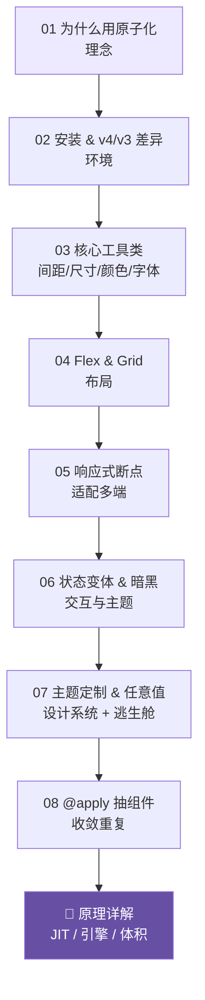

# 29 · Tailwind CSS（原子化 / Utility-First CSS 框架）

> Tailwind CSS 是一套 **Utility-First（原子化）** 的 CSS 框架：不写自定义 CSS，而是在 HTML 里用大量「单一职责的小工具类」（`p-6` `flex` `text-xl` `bg-violet-600`）直接拼样式，配合 **JIT 按需生成**，最终产物只含你真正用到的 CSS，体积极小。
>
> 本工程用 **Tailwind v4**（2025 起的当代版本，CSS-first 配置 + Oxide 引擎），并全程标注与 **v3** 的差异。入门模块用 **Play CDN 免安装**，双击 HTML 即看效果；工程化模块给出 Vite 最小工程。

## 📚 模块索引

| 模块 | 主题 | 一句话 | 运行 |
| --- | --- | --- | --- |
| [01-why-utility-first](./01-why-utility-first) | 为什么用原子化 | 传统 CSS 的三大痛点与 Tailwind 的答案 | CDN |
| [02-setup](./02-setup) | 安装 & v4/v3 差异 | Play CDN 与 Vite 两条路 + v4 CSS-first 配置 | CDN + Vite |
| [03-core-utilities](./03-core-utilities) | 核心工具类 | 间距/尺寸/颜色/字体的命名规律 | CDN |
| [04-flexbox-grid](./04-flexbox-grid) | Flex 与 Grid | 用工具类做导航、卡片墙、页面骨架 | CDN |
| [05-responsive](./05-responsive) | 响应式断点 | Mobile-First 与 `md:` 前缀 | CDN |
| [06-states-dark](./06-states-dark) | 状态变体 & 暗黑 | `hover:` `group` `peer` `dark:`（v4 手动暗黑） | CDN |
| [07-customization](./07-customization) | 主题定制 & 任意值 | v4 `@theme` 令牌 + `[...]` 逃生舱 | CDN |
| [08-apply-components](./08-apply-components) | @apply 抽组件 | 把重复工具类收敛成 `.btn` `.card` | CDN |
| 📄 [原理详解.md](./原理详解.md) | **底层原理** | 原子化理念取舍 · JIT 原理 · v4 引擎 · 体积为何可控 | 文档 |

## 🗺️ 学习路线



## ▶️ 运行方式

- **入门模块（01、03–08）**：免安装，**直接用浏览器打开各模块的 `index.html`**（用 v4 Play CDN `@tailwindcss/browser@4` 在浏览器现场编译）。
- **工程化（02 的 `vite-project/`）**：
  ```bash
  cd 02-setup/vite-project
  npm install
  npm run dev      # 开发服务器
  npm run build    # 生产打包，产物只含用到的类
  ```

## 🔑 本工程要点

- **原子化理念**：样式即 class、免命名、免切文件；复杂度从「看不见的 CSS」搬到「看得见的 HTML」，用组件抽象收敛。
- **v4 关键变化**：CSS-first 配置（`@import "tailwindcss"` + `@theme`，告别 `tailwind.config.js`）、Oxide 引擎（Rust + Lightning CSS，构建快数倍）、自动内容检测、内置容器查询、`@custom-variant` 定制暗黑。
- **体积可控的根因**：JIT 按需生成 + 内容扫描，产物 CSS 与你「用到多少类」成正比，而非与框架大小成正比。

## 🔗 官方文档

- 官网 / 文档：https://tailwindcss.com/docs
- v4 发布说明：https://tailwindcss.com/blog/tailwindcss-v4
- 从 v3 升级：https://tailwindcss.com/docs/upgrade-guide
