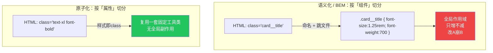
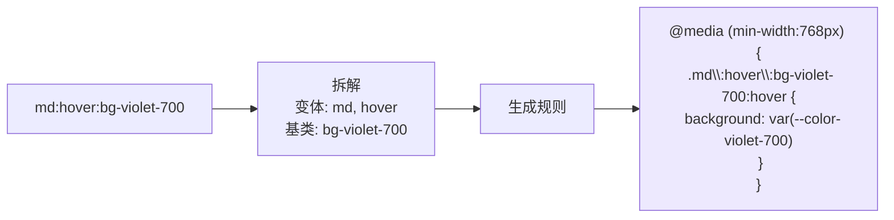
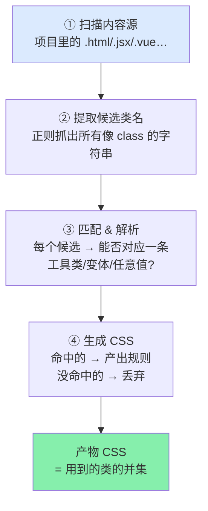
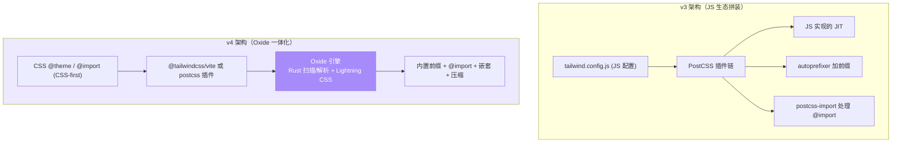
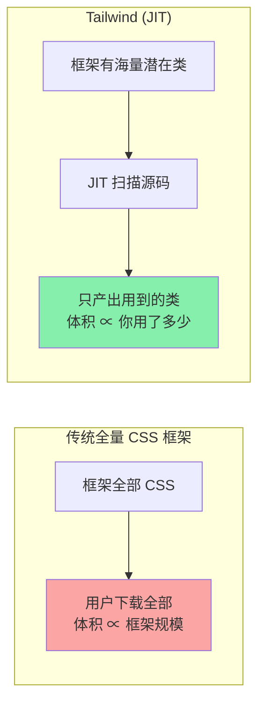

# Tailwind CSS 原理详解（how / why / 底层机制）

> 本文不讲「怎么用工具类」（那是各模块的事），而是讲透：**原子化 CSS 的理念本质与取舍、JIT 是怎么「按需生成」的、v4 的 Oxide 引擎相对 v3 到底变了什么、以及为什么产物体积能小到几乎与项目规模无关。** 对照官方文档与 v4 源码组织整理。

---

## 一、原子化 CSS 的本质与取舍

### 1.1 CSS 的「抽象方向」之争

写 CSS 有两种相反的抽象方向：

- **语义化 / 组件优先（传统、BEM）**：class 描述「这是什么」（`.card__title`），CSS 描述「长什么样」。抽象单位是**组件**。
- **原子化 / Utility-First（Tailwind）**：class 描述「长什么样」（`.text-xl`），一个 class 一条声明。抽象单位是**样式属性**。

### 1.2 原子化解决的三个真实工程问题

1. **命名成本归零**：不再为每个元素起名。命名是 CSS 最大的隐性成本（"There are only two hard things: cache invalidation and naming things"）。
2. **打破全局作用域**：传统 CSS 是全局的，任何选择器都可能互相影响，导致「不敢删」。工具类是**幂等、无副作用**的——`.p-4` 永远只是 `padding:1rem`，删一个 HTML 元素不会有任何遗留 CSS。
3. **CSS 增长曲线被压平**：传统项目 CSS 随功能线性增长；原子化项目里加功能几乎是「复用已有工具类」，CSS 总量趋于收敛（详见第四节）。

### 1.3 取舍：得到什么、付出什么

| 维度 | 收益 | 代价 / 回应 |
| --- | --- | --- |
| 开发速度 | 不切文件、不命名，就地改样式 | 需背工具类命名（有强规律，1–2 天上手） |
| 可维护性 | 无全局副作用、可安心删 | HTML class 变长 → 用组件/`@apply` 收敛（模块 08） |
| 一致性 | 值来自设计令牌，天然统一 | 想突破用任意值 `[...]`，但需自律别滥用 |
| 体积 | JIT 只产用到的类 | 依赖构建扫描源码（见第三节） |

**关键认知**：原子化并没有「消灭」复杂度，而是把它从**隐藏的 CSS 文件搬到可见的 HTML**，再用组件抽象把可见的重复收敛。它也**不是银弹**——强动画、一次性极端定制，写原生 CSS 更直接，Tailwind 用任意值和 `@layer` 给这些场景留了口子。

### 1.4 和 inline style 的本质区别

常见误解是「工具类 = 换皮的 inline style」。区别在于工具类背后有一套**受约束的设计系统**，且能表达 inline style 表达不了的东西：

- **设计令牌约束**：`p-4` 只能取刻度上的值，天然一致；inline `style` 可以写任意混乱值。
- **状态 / 响应式**：`hover:` `md:` `dark:` —— inline style 无法写伪类和媒体查询。
- **可缓存**：工具类是静态 class，样式表可被浏览器缓存；inline style 每个元素都重复带一遍。

---

## 二、工具类是如何映射到 CSS 的

一条工具类在编译后就是一条（或几条）普通 CSS 规则。带变体的类，编译器会包上对应的选择器 / at-rule：

- **变体（variant）** = 给规则加「条件外壳」：`hover:`→`:hover` 选择器，`md:`→`@media` 包裹，`dark:`→`.dark` 祖先选择器或 `prefers-color-scheme`。
- **变体可叠加**，从左到右层层包裹，最终是一条带多重条件的规则。
- 值来自**设计令牌**（v4 里就是 CSS 变量 `var(--color-violet-700)`），这让运行时也能读到这些变量。

---

## 三、JIT 按需生成原理（Just-In-Time）

### 3.1 为什么需要 JIT

Tailwind 理论上的工具类是**组合爆炸**级的：`{颜色 × 色阶} × {属性} × {断点} × {状态} × {任意值}`，全量生成会有数百 MB 的 CSS，不可能全发给浏览器。**JIT 的核心思想：不预生成全集，而是扫描你的源码，只为「真正出现过的类名」生成 CSS。**

（v3.0 之前是「预生成一个大集合 + PurgeCSS 事后删没用的」；v3.1 起 JIT 成为唯一引擎，v4 进一步把它做进 Oxide 引擎。）

### 3.2 JIT 的四步流水线

关键细节：

- **第②步是「宽松文本提取」不是「解析代码」**。Tailwind 不理解你的 JS 逻辑，它只用正则把源文件里所有「看起来像类名的连续字符」抓出来当候选。
- 这带来一条**铁律**：**类名必须以完整字符串静态出现在源码里**。`bg-red-500` 可以，动态拼接的 `` `bg-${color}-500` `` **不行**——提取器看不到完整串，就不会生成。解决办法是写完整分支或用安全列表。
- **任意值 `w-[437px]` 也在此阶段被解析**：提取器抓到这个串，解析器识别 `[...]` 语法，现场生成 `.w-\[437px\]{width:437px}` 这一条规则。这就是「即写即用、无需改配置」的原理。

### 3.3 内容源从哪来：v3 手配 vs v4 自动

- **v3**：必须在 `tailwind.config.js` 的 `content: [...]` 手写 glob，告诉它扫哪些文件；漏配某类文件 → 那里的类名不生成（经典「样式没了」事故）。
- **v4**：**自动内容检测**——默认从项目根扫描，并自动忽略 `.gitignore` 里的文件和二进制/CSS 文件，绝大多数项目免配置。需要时用 CSS 里的 `@source` 指令增删扫描范围。

---

## 四、v4 引擎变化与 v3 差异（Oxide）

Tailwind v4 是一次引擎级重写，代号 **Oxide**。核心变化：

### 4.1 逐项差异对照

| 维度 | v3 | v4 |
| --- | --- | --- |
| **配置载体** | `tailwind.config.js`（JS 对象） | **CSS `@theme`**（CSS-first），JS config 可选（`@config` 兼容） |
| **引入 CSS** | `@tailwind base/components/utilities;` 三行 | **`@import "tailwindcss";` 一行** |
| **构建核心** | JS 实现 | **Oxide：Rust 写的扫描/解析 + [Lightning CSS](https://lightningcss.dev)（Rust）** 做解析/前缀/压缩 |
| **性能** | 基线 | 全量构建快约 3–5×，**增量构建可达 100× 量级**（官方数据） |
| **内容扫描** | 手配 `content` glob | **自动检测** + `@source` 微调 |
| **前缀/嵌套/@import** | 靠 autoprefixer / postcss-import / postcss-nesting | **引擎内置**，无需额外 PostCSS 插件 |
| **主题令牌** | JS 对象，构建期常量 | **真正的 CSS 变量**，运行时可读、可被 JS 改 |
| **颜色空间** | sRGB(hex) | **oklch**，广色域更鲜艳一致 |
| **暗黑手动切换** | `darkMode:'class'`（JS） | **`@custom-variant dark (...)`（CSS）** |
| **容器查询** | 需插件 | **内置**（`@container` + `@md:`） |
| **自定义工具类** | `@layer utilities{}` | 新增 **`@utility`** 指令，能参与变体与排序 |
| **浏览器 CDN** | `cdn.tailwindcss.com` | `@tailwindcss/browser@4` |

### 4.2 为什么要「CSS-first」

v3 的痛点是**割裂**：设计令牌在 JS，样式在 CSS，构建靠 PostCSS 生态一堆插件拼起来。v4 的思路是**回归 CSS 平台自身**——

- 令牌用 CSS 变量表达（`@theme`），既是配置又能运行时 `var()` 复用；
- `@import`、嵌套、前缀这些已被现代浏览器 / Lightning CSS 覆盖的能力收进引擎，减少外部依赖；
- 结果是**更少的配置文件、更少的 JS 依赖、更快的构建**。

### 4.3 Oxide 为什么快

- **热路径用 Rust**：源码扫描、类名解析、CSS 解析/压缩这些 CPU 密集环节从 JS 换成 Rust（Lightning CSS）。
- **更聪明的增量**：改一个文件只重算受影响部分，配合内存缓存，dev 下改一行几乎瞬时（官方称微秒级增量）。
- **一体化**减少了 JS ↔ PostCSS 插件之间的多次 AST 往返。

---

## 五、体积为什么可控（核心卖点的底层解释）

### 5.1 体积与「用到多少类」成正比，而非与框架大小成正比

传统 CSS 框架（如早期 Bootstrap 全量）：**你引入多少，就下载多少**，哪怕只用 10% 的组件。Tailwind 相反：

**产物 CSS = 项目中出现过的工具类的并集。**

### 5.2 为什么这个「并集」会收敛而不膨胀

关键在**复用率**：工具类是**跨组件共享**的。第 1 个卡片用了 `p-6 rounded-xl shadow bg-white`，第 100 个卡片复用**同一批类**，不新增任何 CSS。所以：

- 传统 CSS：每加一个组件 ≈ 加一段新 CSS，**线性增长**。
- Tailwind：每加一个组件 ≈ 复用已有类，**对数式趋于饱和**。项目里出现的**不同**工具类是有限集合（值来自有限的设计令牌），用着用着就「用全了」，之后再写页面几乎不增体积。

因此大型 Tailwind 项目最终 CSS 常稳定在 **~10KB 级（gzip 后）**，且**几乎不随页面数增长**——这正是官方「your CSS stops growing」的含义。

### 5.3 三层叠加把体积压到底

1. **JIT 按需生成**：只产用到的类（第三节）。
2. **复用收敛**：类跨组件共享，并集有上界（本节）。
3. **构建压缩**：Lightning CSS 压缩 + gzip/brotli；工具类高度重复、字符规律，压缩率极高。

---

## 六、常见误区

- **「Tailwind = inline style」** —— 错。工具类有设计令牌约束、支持伪类/媒体查询/主题、可缓存（见 1.4）。
- **「class 太长 = 复杂度增加」** —— 复杂度是**搬家**不是新增；用组件 / `@apply` 收敛（模块 08）。
- **「动态拼类名 `bg-${c}-500` 能用」** —— 不能。JIT 靠静态文本提取，必须写完整串或用 safelist（见 3.2）。
- **「Play CDN 能上生产」** —— 不能。CDN 版在浏览器实时编译，体积大、首屏慢，只适合学习/原型；生产走构建。
- **「v4 里 `@tailwind base` 还能用」** —— 不能，v4 改成 `@import "tailwindcss";` 一行。
- **「v4 必须删掉 tailwind.config.js」** —— 不必；`@config "./tailwind.config.js";` 可继续用，便于迁移。
- **「产物体积取决于框架大小」** —— 取决于你用了多少不同的类（第五节）。

---

## 🔗 参考

- 官方文档：https://tailwindcss.com/docs
- Utility-First 理念：https://tailwindcss.com/docs/styling-with-utility-classes
- v4 发布说明（Oxide / 性能 / CSS-first）：https://tailwindcss.com/blog/tailwindcss-v4
- 从 v3 升级指南（逐项差异）：https://tailwindcss.com/docs/upgrade-guide
- 主题 @theme：https://tailwindcss.com/docs/theme
- 内容检测 / @source：https://tailwindcss.com/docs/detecting-classes-in-source-files
- Lightning CSS（Oxide 所用 CSS 引擎）：https://lightningcss.dev
