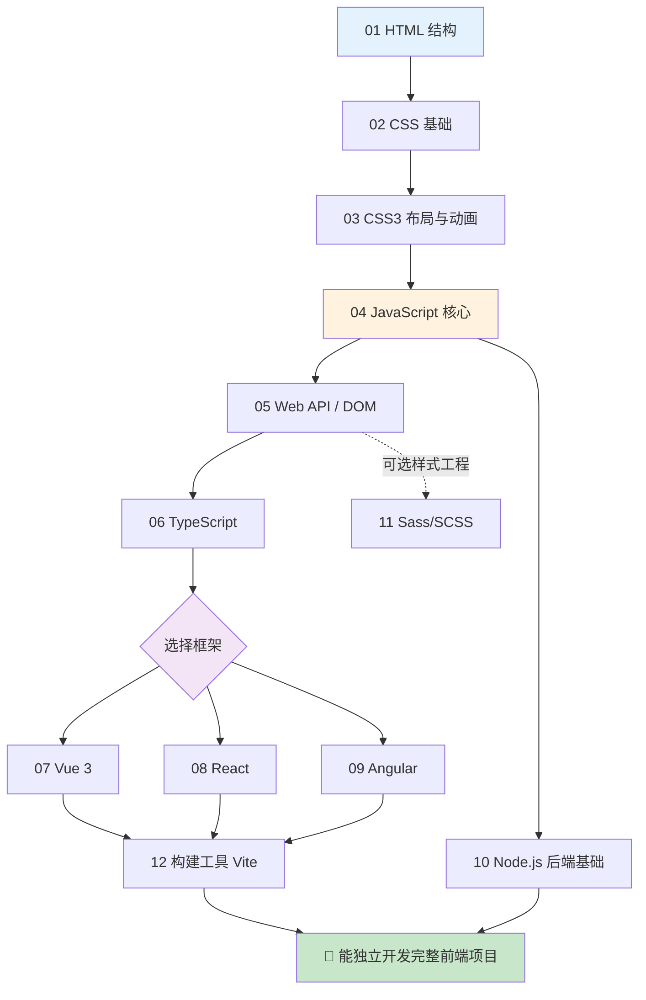

# 前端学习合集 🎨

> 一个仓库装下前端全栈知识。**每个技术栈一个工程，每个知识点一个独立可运行的小 demo**，全程详细中文注释 + Mermaid 流程图 + 模块独立 README。所有内容对照各自**官方权威文档**整理。

参照姊妹项目 [`ai-learning`](../ai-learning) 的「一知识点一模块」风格，迁移到前端。

---

## 一、工程总览

| # | 工程 | 内容 | 权威来源 | 运行方式 |
|---|---|---|---|---|
| 01 | [`01-html`](01-html) | HTML5 结构与语义化 | MDN | 浏览器直接打开 |
| 02 | [`02-css`](02-css) | CSS 基础（盒模型/选择器/定位） | MDN | 浏览器直接打开 |
| 03 | [`03-css3`](03-css3) | CSS3 进阶（Flex/Grid/动画/响应式） | MDN | 浏览器直接打开 |
| 04 | [`04-javascript`](04-javascript) | JS 核心语言（ES6+/异步/原型） | MDN / ECMAScript | 浏览器 / Node |
| 05 | [`05-web-api`](05-web-api) | 浏览器 API（DOM/BOM/Fetch/Storage） | MDN | 浏览器直接打开 |
| 06 | [`06-typescript`](06-typescript) | TypeScript 类型系统 | typescriptlang.org | tsc 编译 |
| 07 | [`07-vue`](07-vue) | Vue 3（组合式 API/路由/Pinia） | cn.vuejs.org | CDN / Vite |
| 08 | [`08-react`](08-react) | React（Hooks/路由/状态） | react.dev | CDN / Vite |
| 09 | [`09-angular`](09-angular) | Angular（Signals/DI/RxJS） | angular.dev | Angular CLI |
| 10 | [`10-nodejs`](10-nodejs) | Node.js（fs/http/流/Express） | nodejs.org | node 运行 |
| 11 | [`11-sass`](11-sass) | Sass/SCSS 预处理器 | sass-lang.com | sass 编译 |
| 12 | [`12-build-tools`](12-build-tools) | 前端工程化（Vite/Webpack） | vitejs.dev | npm |

> 每个工程目录下有自己的 `README.md`（模块索引 + 学习路线图）；每个模块目录下有 demo + 模块 `README.md`（知识讲解 + 流程图）。

---

## 二、推荐学习路线



**三阶段建议：**

1. **基础三件套**（01→02→03→04→05）：HTML 搭骨架、CSS 做样式、JS 加交互、Web API 操作页面。学完能写静态页面 + 原生交互。
2. **工程化进阶**（06 TypeScript → 11 Sass → 12 构建工具）：用类型和工具武装自己。
3. **框架专精**（07/08/09 任选其一深入，其余了解）：Vue 上手快、React 生态大、Angular 适合大型团队。配合 10 Node.js 理解前后端协作。

---

## 三、目录结构

```
frontend-learning/
├── README.md            ← 本文件（总览 + 学习路线）
├── _CONVENTIONS.md      ← 统一规范（所有工程一致的风格标准）
├── 01-html/
│   ├── README.md        ← 工程级：模块索引 + 路线图
│   ├── 01-xxx/
│   │   ├── README.md    ← 模块级：知识讲解 + Mermaid 流程图 + 运行方式
│   │   └── index.html   ← 可运行 demo
│   └── ...
└── 02-… ~ 12-…          ← 同上结构
```

---

## 四、如何使用

- **看一个知识点**：进入对应模块目录，先读 `README.md` 理解概念和流程图，再打开/运行 demo 对照代码。
- **免构建工程**（01~05、11）：直接用浏览器打开模块里的 `index.html`。
- **需构建工程**（07~09、12 进阶）：按模块 README 里的 `npm install && npm run dev` 运行。
- **Node / TS / Sass**：按各模块 README 的命令（`node x.js` / `npx tsc` / `npx sass`）运行。

---

> 📌 所有内容均对照官方文档整理，并在每个模块 README 末尾给出官方链接，便于深入查证。
